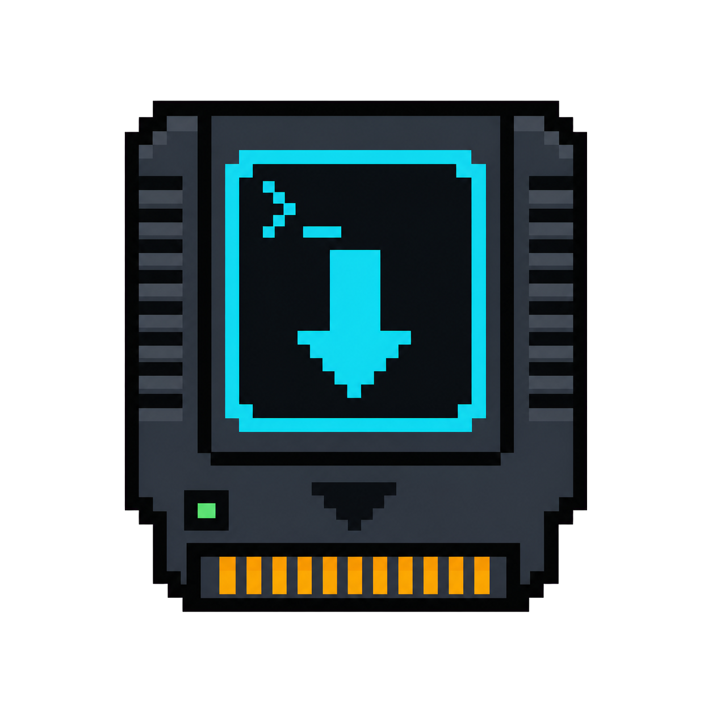
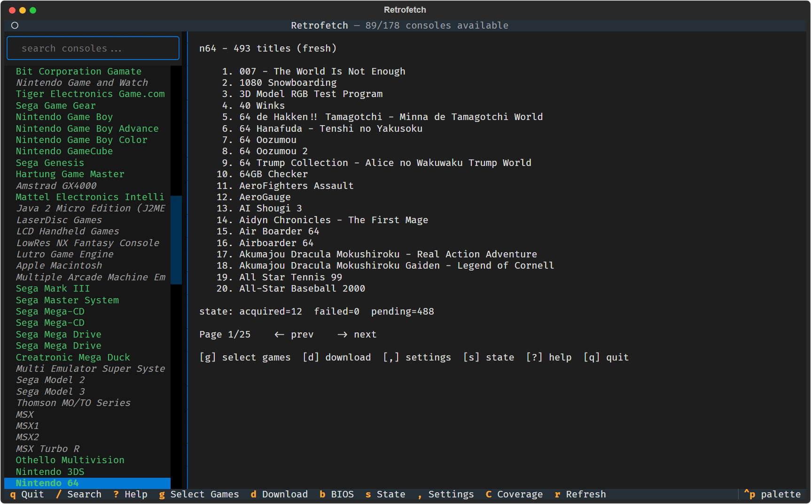
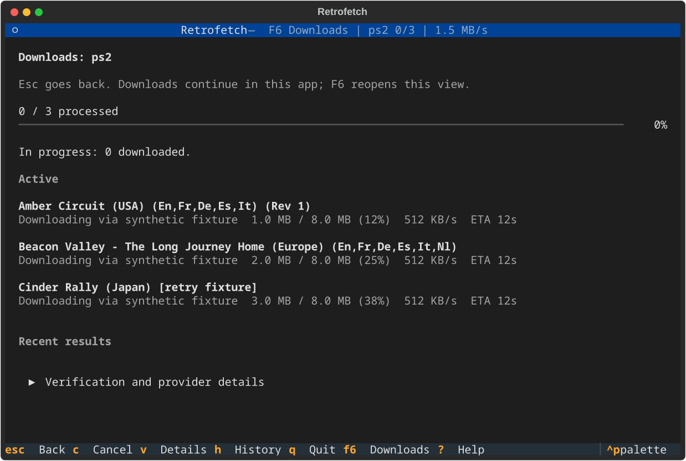

<p align="center">
  
</p>

<h1 align="center">Retrofetch</h1>

<p align="center">
  <strong>Find and download retro games from multiple online providers in one place.</strong>
</p>

<p align="center">
  <a href="https://github.com/veedy-dev/retrofetch/releases">Download for Windows</a>
  &middot; <a href="#linux-and-macos">Linux/macOS setup</a>
  &middot; <a href="#how-it-works">How it works</a>
  &middot; <a href="#development-and-contributing">Develop and contribute</a>
</p>

<p align="center">
  
  
  
  <a href="LICENSE"></a>
</p>

Retrofetch brings game listings from supported archives and online providers into one easy app. Search for a console, choose the games you want, review the list, and follow every download without jumping between websites or setting up each transfer by hand.

> **Please note:** Retrofetch does not host or include games or firmware. Downloads come from independent third-party providers, so availability can change. You are responsible for following local laws and each provider's terms.



## Install

### Windows

1. Open the [Releases page](https://github.com/veedy-dev/retrofetch/releases).
2. Download **`RetrofetchSetup.exe`**.
3. Double-click the installer, then open Retrofetch from your desktop or Start menu.
4. Choose where your games and BIOS files should be stored when the app first opens.

No Python installation or terminal commands are needed.

> Current builds are not code-signed yet, so Windows may show an **Unknown publisher** warning. Only download Retrofetch from this repository.

Prefer a portable app? Download **`Retrofetch.exe`** from the same Releases page and double-click it.

### Linux and macOS

There is no packaged app for Linux or macOS yet. Install Git and Python 3.10 or newer, then run:

```bash
git clone https://github.com/veedy-dev/retrofetch.git
cd retrofetch
python3 -m venv .venv
. .venv/bin/activate
pip install -e .
retrofetch tui
```

The guided qBittorrent setup is currently Windows-only, so some torrent-backed downloads require Windows for now.

## How it works

1. Search for a console.
2. Choose one or more games.
3. Review the download list and remove anything you no longer want.
4. Start the download and follow its progress in the app.

Retrofetch keeps active downloads and completed history when you close and reopen it. If a provider needs qBittorrent, the app explains what is needed and guides you through setup.

## Features

- Game listings from multiple supported providers.
- Search and selection without opening several websites.
- A download list you can review before starting.
- Clear progress, speed, remaining time, seeds, and peers.
- Downloads that can continue after restarting Retrofetch.
- File verification when matching verification data is available.



## Basic controls

| Key | Action |
|---|---|
| Arrow keys | Move through lists |
| `Enter` | Open or confirm |
| `/` | Search |
| `g` | Choose games |
| `d` | Review and start downloads |
| `,` | Open settings |
| `Esc` | Go back or cancel |
| `?` | Open help |
| `q` | Quit |

The available controls are always shown at the bottom of the app.

## Notes

- Some games may disappear when a provider removes a file or becomes unavailable.
- Torrent speed depends on the people sharing that file, not only your internet speed.
- Retrofetch resets game selections when reopened, but keeps active and completed downloads.
- Files are marked verified only when matching verification data is available.

## Development and contributing

Feature requests, bug reports, and pull requests are welcome. [Open an issue](https://github.com/veedy-dev/retrofetch/issues) to share an idea or report a problem.

To work on Retrofetch locally:

```bash
git clone https://github.com/veedy-dev/retrofetch.git
cd retrofetch
python -m venv .venv
```

Activate the environment with `.\.venv\Scripts\Activate.ps1` on Windows or `. .venv/bin/activate` on Linux and macOS, then run:

```bash
python -m pip install -e ".[build]" pytest ruff pyright
python -m pytest -q
python -m ruff check .
pyright
```

Build the Windows app with:

```powershell
.\packaging\build_windows.ps1 -InstallTools
```

## License

[MIT](LICENSE) &copy; 2026 veedy-dev
